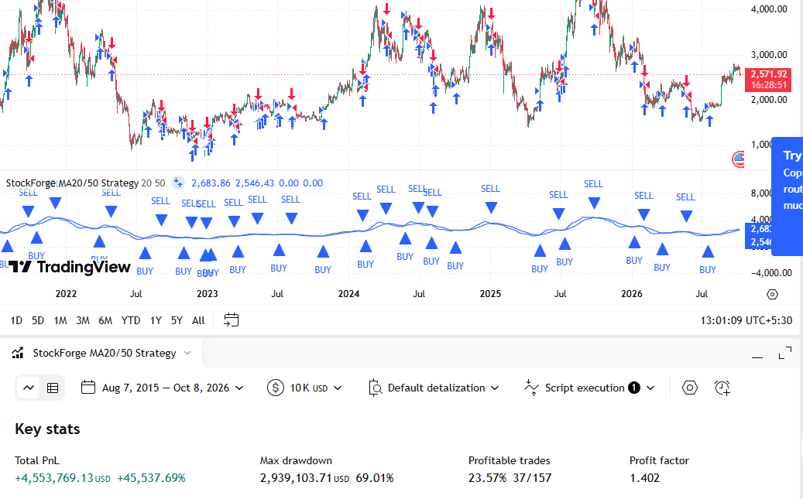

# StockForge 📈   &nbsp;&nbsp;   

## 🚧 Under Development

> **Note:** We're not trying to build a highly advanced quant trading algorithm right away. StockForge will start as a basic backtesting model, and we'll gradually scale it up over time.

## View in action

## Dependencies

StockForge uses the following open-source Python libraries:

- [yfinance](https://github.com/ranaroussi/yfinance)
- [pandas](https://github.com/pandas-dev/pandas)
- [matplotlib](https://github.com/matplotlib/matplotlib)

These projects are distributed under their respective licenses.
